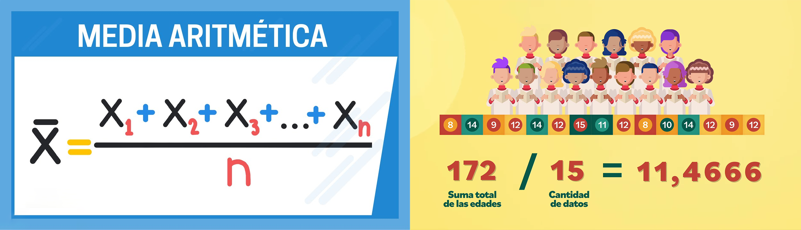
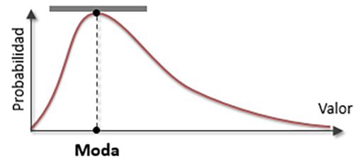
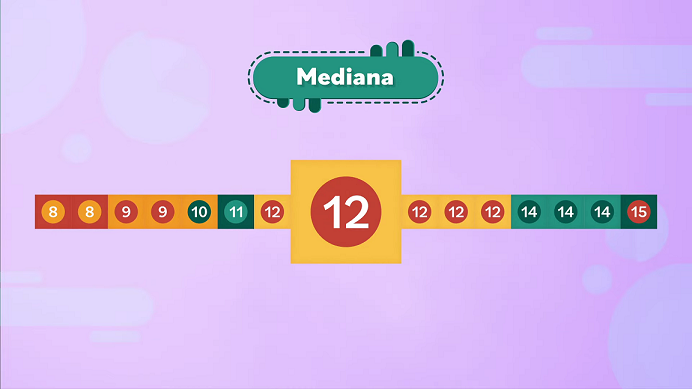

# Estadistica-Media-Mediana-y-Moda
Ejemplos teóricos y prácticas del uso de la Media, la Mediana y la Moda con python.

## Media

La media es la suma del conjunto de valores dividida entre el número total de valores

# Moda
La moda es el valor que aparece con mayor frecuencia en un conjunto de valores de datos.

# Mediana

La mediana es el valor que ocupa el lugar central de todos los datos cuando éstos están ordenados de menor a mayor.

